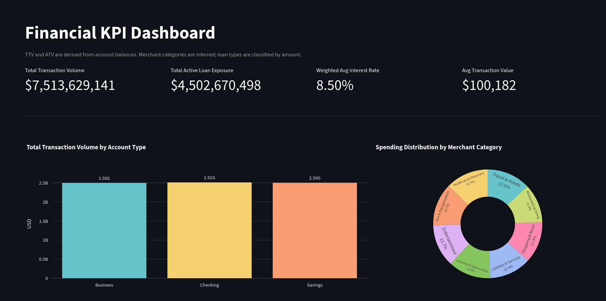

# VisualizationAPI
Josue David Chan Negroe
Nahum Francisco Massa Mandujano
Elio Eduardo Ucan Zapata

Loads CSV data files into a PostgreSQL database and provides an interactive financial KPI dashboard built with Streamlit and Plotly.

## Requirements

- Python 3.10+
- PostgreSQL (for the data loader)

Install dependencies:

```bash
pip install -r requirements.txt
```

## Project Structure

```
VisualizationAPI/
├── data/               # Source CSV datasets
│   ├── accounts.csv
│   ├── branches.csv
│   ├── cards.csv
│   ├── customers.csv
│   ├── loans.csv
│   └── merchants.csv
├── dashboard/
│   ├── app.py          # Streamlit dashboard entry point
│   └── charts.py       # Plotly chart builder functions
├── scripts/
│   └── load_csv_to_db.py  # CSV → PostgreSQL loader
└── requirements.txt
```

## Dashboard

The dashboard visualizes five financial KPIs using different chart types:

| KPI | Chart |
|-----|-------|
| Total Transaction Volume (TTV) | Vertical bar chart — total balance by account type |
| Spending Distribution by Merchant Category | Donut chart — merchant network by inferred category |
| Average Transaction Value (ATV) by Account Type | Horizontal bar chart — mean balance per account type |
| Total Active Loan Exposure | Treemap — loan exposure by type and interest rate tier |
| Weighted Average Interest Rate by Loan Type | Vertical bar chart — portfolio-weighted rate per loan type |

Loan types are classified by amount: **Personal** (< $25k), **Auto** ($25k–$100k), **Mortgage** (> $100k).



### Run the dashboard

```bash
streamlit run dashboard/app.py
```

Then open http://localhost:8501 in your browser.

## Database Loader

### Configuration

Copy `.env.example` to `.env` and fill in your database credentials:

```bash
cp .env.example .env
```

| Variable      | Description       | Default     |
|---------------|-------------------|-------------|
| `DB_HOST`     | PostgreSQL host   | `localhost` |
| `DB_PORT`     | PostgreSQL port   | `5432`      |
| `DB_NAME`     | Database name     | required    |
| `DB_USER`     | Database user     | required    |
| `DB_PASSWORD` | Database password | _(empty)_   |

### Data relationships

- `accounts.customer_id → customers.customer_id`
- `cards.account_id → accounts.account_id`
- `loans.customer_id → customers.customer_id`

### Run the loader

```bash
python scripts/load_csv_to_db.py
```

The script will:

1. Connect to the database using the `.env` credentials.
2. Create or extend tables based on the CSV headers.
3. Add primary keys and supported foreign-key relationships.
4. Insert all rows in dependency order.
